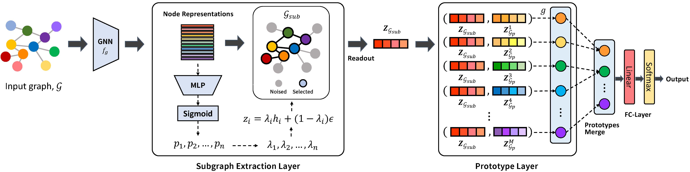

# 基于原型的可解释图信息瓶颈
2023年NeurIPS会议上基于原型的可解释图信息瓶颈的官方源代码。

基于原型的可解释图信息瓶颈概述。

图神经网络（GNNs）的成功引发了对其决策过程的理解和对其预测提供解释的需求，这催生了可解释人工智能（XAI），它为黑箱模型提供透明的解释。最近，使用原型成功地提高了模型的可解释性，通过学习原型来暗示影响预测的训练图。然而，这些方法往往提供包含整个图过多信息的原型，导致关键子结构的排除或无关子结构的包含，这可能会限制模型在下游任务中的可解释性和性能。在这项工作中，我们提出了一种新的可解释GNN框架，称为基于原型的可解释图信息瓶颈（PGIB），它在信息瓶颈框架内结合了原型学习，以提供包含输入图中对模型预测重要的关键子图的原型。这是首次将原型学习纳入识别对预测性能有关键影响的关键子图的过程。广泛的实验，包括定性分析，表明PGIB在预测性能和可解释性方面均优于最先进的方法。

## 要求

```
pytorch                   1.11.0             
torch-geometric           2.0.4
torch-scatter             2.0.9
torch-sparse              0.6.13
```

## 数据集

* 在此链接下载图分类数据集 https://chrsmrrs.github.io/datasets/
* 在此链接下载图解释数据集 https://github.com/Samyu0304/graph-information-bottleneck-for-Subgraph-Recognition/tree/main/graph-interpretation/input
* 此文件夹包含以下逗号分隔的文本文件（用数据集名称替换DS）：
  - n = 节点总数
  - m = 边总数
  - N = 图的数量
  - DS_A.txt (m行) : 所有图的稀疏（块对角）邻接矩阵，每行对应（行，列）即（node_id, node_id）
  - DS_graph_indicator.txt (n行) : 所有图的所有节点的图标识符列向量，第i行的值是node_id为i的节点的graph_id
  - DS_graph_labels.txt (N行) : 数据集中所有图的类别标签，第i行的值是graph_id为i的图的类别标签
  - DS_node_labels.txt (n行) : 节点标签列向量，第i行的值对应于node_id为i的节点
* 如果有相应的信息，还有可选文件：
  - DS_edge_labels.txt (m行; 与DS_A_sparse.txt大小相同) : DD_A_sparse.txt中边的标签
  - DS_edge_attributes.txt (m行; 与DS_A.txt大小相同) : DS_A.txt中边的属性
  - DS_node_attributes.txt (n行) : 节点属性矩阵，第i行的逗号分隔值是node_id为i的节点的属性向量
  - DS_graph_attributes.txt (N行) : 数据集中所有图的回归值，第i行的值是graph_id为i的图的属性

## 运行

```
python -m models.train_gnns
```